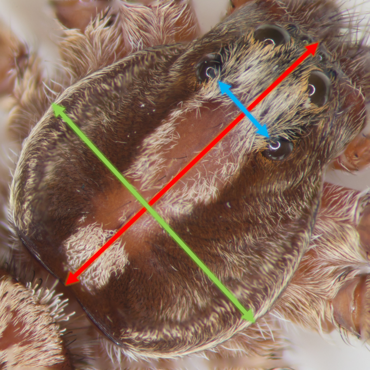

\RaggedRight

# Introduction
Principle component analysis (PCA) distributes the variation in a multivariate dataset across *components*. This allows us to visualize patterns that would not be apparent with common graphical techniques. Linear algebra is at the heart of the PCA, but this discussion will be light on mathematical theory. Instead, you can expect a gentle introduction to the topic, which will include how this ordination technique in carried out in R.

# Accomplishing the PCA *manually*
With the powerful tools available to us in R, there is no need to conduct a PCA manually. Contained within one line of code, R has native functions which can handle the heavy-lifting for us. My goal for the *manual* PCA is to expose you to the terminology and concepts in PCA. As such, you will be better prepared to defend your analysis.

## Motivating example - wolf spider morphometrics
The original motivation for this analysis was to establish a standard algorithm to determine the "size" of a wolf spider. One way to accomplish this is with a PCA of morphometric characteristics. The parameters which possess the highest degree of variation will be the most optimal predictor of animal size.


```{r echo=FALSE, fig.height=3.5, fig.width=3.5}

```

```{r echo=TRUE, fig.align = "center"}
library(psych)
load("morpho_complete.Rdata")
pairs.panels(
  # eliminate factor variables & untransformed weights from plots
  morpho_complete[,-c(1,2,6)],
  main = "Wolf Spider Morphometrics - Correlation Summary",
  gap = 0, # set to zero for no gap between plot panels
  lm = TRUE, # draw linear regression lines for pairs
  stars = TRUE, # display significance
  bg = c("red", "blue")[morpho_complete$sex], # color based on sex 
  pch = 21) # data point shape
```

### Covariance or Correlation?
PCA is a dimentionality reduction technique that allows us to see latent patterns in the data. To do this, the PCA is based heavily on concepts in linear algebra: eigenvalues, eigenvectors and singular value decomposition are at the heart of the PCA. First, we need to establish whether the metrics in our dataset are *like* or *mixed*. If the dataset contains the same units of measure across all of the variables -- i.e. all variables are weights in grams -- we *standardize* the data via mean-centering and employ a *covariance* matrix. However, if our data contains mixed units -- like the morphometric data in this example -- we mean-center the data, divide by the standard deviation, and employ a *correlation* matrix. Which matrix you choose becomes important when setting the parameters of the built-in PCA functions in R.

Our data has *mixed* metrics - weight (mg) and linear measures (mm). 

### Standardize the Data: Mean-center and Divide by the Standard Deviation
```{r echo=TRUE, message=FALSE, fig1, fig.height = 5, fig.width = 5, fig.align = "center"}
library(ggplot2)

standardize <- function(x) {(x - mean(x))/sd(x)}

# Eliminate factor variables & untransformed weights from the scaled data
my.scaled.data <- as.data.frame(apply(morpho_complete[,-c(1,2,6)], 2, standardize))

ggplot(my.scaled.data, aes(interoc, cwidth)) +
  geom_point(size = 2) +
  geom_smooth(method = 'lm') +
  ggtitle("Plot of Interoccular Distance and Carapace Width") +
  theme(plot.title = element_text(hjust = 0.5)) # center plot title
```

### Find the Eigenvalues & Eigenvectors
```{r}
# Calculate correlation matrix
my.cor <- cor(my.scaled.data)

# Save the eigenvalues of the correllation matrix
my.eigen <- eigen(my.cor)

# Rename matrix rows and columns for easier interpretation
rownames(my.eigen$vectors) <- c("interoc", "cwidth", "clength", "T.weight")
colnames(my.eigen$vectors) <- c("PC1", "PC2", "PC3", "PC4")
```

In Table 1, each column is an eigenvector. Each eigenvector is a *principal component* (PC) with its own eigenvalue.

```{r echo=FALSE, message=FALSE}
library(dplyr)
library(kableExtra)
eigen.table <- as.data.frame(my.eigen$vectors)
kable(eigen.table, "latex", booktabs = TRUE, caption = "Eigenvectors")
```

The eigenvalues are used to identify which principal component(s) have the strongest correlation with the overall dataset: the higher the eigenvalue, the stronger its correlation.

```{r echo=FALSE, message=FALSE}
library(dplyr)
library(kableExtra)
eigen.values <- data.frame(PC = c("PC1", "PC2", "PC3", "PC4"),
                           eigenvalues = my.eigen$values)
kable(eigen.values, "latex", booktabs = TRUE, caption = "Eigenvalues For PCs")
```

Each eigenvector is a *linear combination* of the variables `interoc`, `cwidth`, `clength`, `T.weight`.

Note that the sum of the eigenvalues equals the total variance of the scaled data
```{r}
sum(my.eigen$values)

sum(
  var(my.scaled.data[,1]),
  var(my.scaled.data[,2]),
  var(my.scaled.data[,3]),
  var(my.scaled.data[,4]))
```