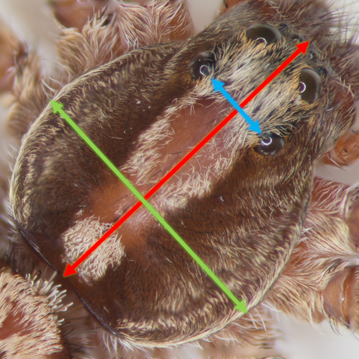

<style>
hr { 
  display: block;
  margin-top: 0.5em;
  margin-bottom: 0.5em;
  margin-left: auto;
  margin-right: auto;
  border-style: inset;
  border-width: 1px;
} 
</style>

<hr>

```{r echo=FALSE, message=FALSE, warning=FALSE}
if (!require("devtools")) install.packages("devtools", dependencies = TRUE)
if (!require("pacman")) install.packages("pacman", dependencies = TRUE)
if (!require("plyr")) install.packages("plyr", dependencies = TRUE)
if (!require("dplyr")) install.packages("dplyr", dependencies = TRUE)
if (!require("psych")) install.packages("psych", dependencies = TRUE)
if (!require("car")) install.packages("car", dependencies = TRUE)
if (!require("MASS")) install.packages("MASS", dependencies = TRUE)
if (!require("kableExtra")) install.packages("kableExtra", dependencies = TRUE)
if (!require("rmarkdown")) install.packages("rmarkdown", dependencies = TRUE)
if (!require("knitr")) install.packages("knitr", dependencies = TRUE)
if (!require("pastecs")) install.packages("pastecs", dependencies = TRUE)
if (!require("paran")) install.packages("paran", dependencies = TRUE)
if (!require("ggplot2")) install.packages("ggplot2", dependencies = TRUE)
if (!require("gridExtra")) install.packages("gridExtra", dependencies = TRUE)
if (!require("ggrepel")) install.packages("ggrepel", dependencies = TRUE)
if (!require("ggpubr")) install.packages("ggpubr", dependencies = TRUE)
if (!require("ggbiplot")) install_github("vqv/ggbiplot")

library(pacman)

p_load(devtools, plyr, dplyr, psych, car, MASS, kableExtra, rmarkdown, knitr,
       pastecs, paran, pcaMethods, ggplot2, gridExtra, ggrepel, ggpubr, ggbiplot)
```

# Introduction
Principle component analysis (PCA) distributes the variation in a multivariate dataset across *components*. The PCA allows us to visualize patterns that would not be apparent with common graphical techniques. Linear algebra is at the heart of the PCA, but this discussion will be light on mathematical theory. Instead, you can expect a gentle introduction to the topic, which will include how this ordination technique is carried out in R.

# Accomplishing the PCA *Manually*
With the powerful tools available to us in R, there is no need to conduct a PCA manually. Contained within one line of code, R has native functions which can handle the heavy-lifting for us. My goal for the *manual* PCA is to expose you to the terminology and concepts in PCA. As such, you will be better prepared to defend your analysis.

## Motivating example - wolf spider morphometrics
The original motivation for this analysis was to establish a standard algorithm to determine the "size" of a wolf spider. One way to accomplish this is with a PCA of morphometric characteristics. The parameters which possess the highest degree of variation will be the most optimal predictor of animal size.

<br>
```{r echo=FALSE, fig.align = "center"}

```
*Blue: interocular distance, Green: carapace width, Red: carapace length*

Descriptive Statistics
<br>
```{r}
# Load the full data set
load("morpho_complete.Rdata")

# Eliminate factor variables & untransformed weights from full dataset
morpho <- morpho_complete[,-c(1,2,6)]

morpho.stats <- round(stat.desc(morpho, basic = FALSE), digits = 3)
kable(morpho.stats, caption = "Descriptive Statistics") %>%
  kable_styling(bootstrap_options = c("striped", "hover", "condensed", "responsive"), full_width = F)
```

<br>
```{r echo=TRUE, fig.align = "center"}
pairs.panels(
  morpho,
  main = "Wolf Spider Morphometrics - Correlation Summary",
  gap = 0, # set to zero for no gap between plot panels
  lm = TRUE, # draw linear regression lines for pairs
  stars = TRUE, # display significance
  bg = c("red", "blue")[morpho_complete$sex], # color based on sex 
  pch = 21) # data point shape
```

## Covariance or Correlation?
PCA is a dimensionality reduction technique that allows us to see latent patterns in the data. To do this, the PCA is based heavily on concepts in linear algebra: eigenvalues and eigenvectors are at the heart of the PCA. First, we need to establish whether the metrics in our dataset are *like* or *mixed*. If the dataset contains the same units of measure across all of the variables -- i.e. all variables are weights in grams -- we *standardize* the data via mean-centering and employ a *covariance* matrix. However, if our data contains mixed units -- like the morphometric data in this example -- we mean-center the data, divide by the standard deviation, and employ a *correlation* matrix. Which matrix you choose becomes essential when setting the parameters of the built-in PCA functions in R.

Our data has *mixed* metrics - weight (mg) and linear measures (mm). 

## Standardize the Data: Mean-center and Divide by the Standard Deviation
```{r echo=TRUE, message=FALSE, fig1, fig.height = 5, fig.width = 5, fig.align = "center"}
standardize <- function(x) {(x - mean(x))/sd(x)}

# Eliminate factor variables & untransformed weights from the scaled data
my.scaled.data <- as.data.frame(apply(morpho, 2, standardize))

ggplot(my.scaled.data, aes(interoc, cwidth)) +
  geom_point(size = 2) +
  geom_smooth(method = 'lm') +
  ggtitle("Plot of Interoccular Distance and Carapace Width") +
  theme(plot.title = element_text(hjust = 0.5)) # center plot title
```

## Find the Eigenvalues & Eigenvectors
```{r}
# Calculate correlation matrix
my.cor <- cor(my.scaled.data)

# Save the eigenvalues of the correllation matrix
my.eigen <- eigen(my.cor)

# Rename matrix rows and columns for easier interpretation
rownames(my.eigen$vectors) <- c("interoc", "cwidth", "clength", "T.weight")
colnames(my.eigen$vectors) <- c("PC1", "PC2", "PC3", "PC4")
```

<br>
```{r echo=FALSE, message=FALSE}
eigen.table <- as.data.frame(my.eigen$vectors)
kable(eigen.table, caption = "Eigenvectors") %>%
  kable_styling(bootstrap_options = c("striped", "hover", "condensed", "responsive"),
                full_width = F, position = "float_left") %>%
  column_spec(1, bold = TRUE)
```

```{r echo=FALSE, message=FALSE}
eigen.values <- data.frame(PC = c("PC1", "PC2", "PC3", "PC4"),
                           eigenvalues = my.eigen$values)
kable(eigen.values, caption = "Eigenvalues For PCs") %>%
  kable_styling(bootstrap_options = c("striped", "hover", "condensed", "responsive"), full_width = F) %>%
  column_spec(1, bold = TRUE)
```

Each column in the table above (left) is an eigenvector. Each eigenvector is a *principal component* (PC) with its eigenvalue. These eigenvalues are given in the right table above. The eigenvalues are used to identify which principal component(s) have the strongest correlation with the overall dataset: the higher the eigenvalue, the stronger its correlation. Each eigenvector is a *normalized linear combination* of the variables `interoc`, `cwidth`, `clength`, `T.weight`. 

The coefficients are known as *loadings* which are values $\small[-1, 1]$. We can see that the variables of interest in PC1 trend together due to all of the coefficients having the same sign.

<br>
Note that the sum of the eigenvalues equals the total variance of the scaled data
```{r}
sum(my.eigen$values)

sum(
  var(my.scaled.data[,1]),
  var(my.scaled.data[,2]),
  var(my.scaled.data[,3]),
  var(my.scaled.data[,4]))
```

## Amount of Variation Captured by the PCs in the Dataset
Take each eigenvalue and divide it by the total of all eigenvalues -- the total variation in the dataset -- then multiply by 100. This calculation yields a table with the percent variation for each PC.

```{r}
pc1.var <- 100*round(my.eigen$values[1]/sum(my.eigen$values), digits = 3)
pc2.var <- 100*round(my.eigen$values[2]/sum(my.eigen$values), digits = 3)
pc3.var <- 100*round(my.eigen$values[3]/sum(my.eigen$values), digits = 3)
pc4.var <- 100*round(my.eigen$values[4]/sum(my.eigen$values), digits = 3)

pc <- data.frame(PC = c("PC1", "PC2", "PC3", "PC4"),
                 Percentage = c(pc1.var, pc2.var, pc3.var, pc4.var))

kable(pc, caption = "Amount of Variation Captured by PCs") %>%
  kable_styling(bootstrap_options = c("striped", "hover", "condensed", "responsive"), full_width = F)
```

<br>
The total variation should sum to ~100% depending on rounding error:
```{r}
sum(pc1.var, pc2.var, pc3.var, pc4.var)
```

## What are the PCA "scores"?
Express the loadings and scaled data as matrices, then multiply them together. The result is a new matrix which expresses the data in terms of the PCs. These are the PCA *scores*.

```{r}
loadings <- my.eigen$vectors
my.scaled.matrix <- as.matrix(my.scaled.data)
# the function %*% is matrix multiplication
scores <- my.scaled.matrix %*% loadings
sd <- sqrt(my.eigen$values)
rownames(loadings) <- colnames(my.scaled.data)

kable(head(scores), caption = "PCA Scores - First Six Rows") %>%
  kable_styling(bootstrap_options = c("striped", "hover", "condensed", "responsive"),
                full_width = F)
```

# Accomplishing the PCA with Native R Functions
The function `prcomp` is the primary tool for PCA in base R.
```{r}
pca_morpho <- prcomp(morpho, center = TRUE, scale. = TRUE)

# Show the variables in the class "prcomp"
ls(pca_morpho)
```


Rotations are often referred to as the "loadings" of a PCA.
```{r}
pca_loadings <- pca_morpho$rotation
kable(pca_loadings, caption = "PCA Loadings") %>%
  kable_styling(bootstrap_options = c("striped", "hover", "condensed", "responsive"),
                full_width = F)
```

Summary output of the PCA:
```{r}
pca_summary <- summary(pca_morpho)$importance %>%
  as.data.frame()
kable(pca_summary, caption = "PCA Summary") %>%
  kable_styling(bootstrap_options = c("striped", "hover", "condensed", "responsive"), full_width = F)
```

## Orthogonality of PCs
```{r echo=TRUE, fig.align = "center"}
pairs.panels(
  pca_morpho$x,
  main = "PCA Correlation Summary",
  gap = 0, # set to zero for no gap between plot panels
  lm = TRUE, # draw linear regression lines for pairs
  stars = TRUE, # display significance
  bg = c("red", "blue")[morpho_complete$sex], # color based on sex 
  pch = 21) # data point shape
```

PCs are *orthogonal vectors*. Thus, the correlation coefficients equal zero for all possible pairwise combinations of PCs. Therefore, it is often used as a precursor to predictive modeling procedures as multicollinearity is eliminated.

## Biplot
The *biplot* is the primary visualization tool for PCA. 
```{r fig.align="center", fig.width=9, message=FALSE}
# Plot without ID labels
g <- ggbiplot(pca_morpho,
              obs.scale = 1,
              var.scale = 1,
              groups = morpho_complete$sex,
              ellipse = TRUE,
              circle = FALSE,
              # draw ellipse around points (+/-) 1 standard deviation
              ellipse.prob = 0.68) +
  scale_color_discrete(name = '') +
  theme(legend.direction = "horizontal", legend.position = "top", aspect.ratio = 1)

# Plot with ID labels
h <- ggbiplot(pca_morpho,
              obs.scale = 1,
              var.scale = 1,
              groups = morpho_complete$sex,
              ellipse = TRUE,
              circle = FALSE,
              # draw ellipse around points (+/-) 1 standard deviation
              ellipse.prob = 0.68) +
  scale_color_discrete(name = '') +
  theme(legend.direction = "horizontal", legend.position = "top", aspect.ratio = 1) +
  geom_text_repel(aes(label = morpho_complete$id))

figure <- ggarrange(g, h, ncol = 2)

annotate_figure(figure,
               top = text_grob("PCA Biplots - Morphometric Data",
                               color = "black", face = "bold", size = 14),fig.lab.face = "bold")
```
*PCA biplots without and with spider ID labels. Pink: females, Red: males.*

## Interpreting the Biplot
Each variable in the dataset is plotted as a vector (red arrows). The cosine of the angle between any two vectors equals their correlation. For insatnce interoccular width and carapace width have a minimal angle between them, indicating high correlation.

Regarding carapace length, let's look at spider ID#336 (male) and ID#339 (female):
```{r}
filter(morpho_complete, id == "336" | id == "339")

paste("minimum carapace length =",
      min(morpho_complete$clength),
      "maximum carapace length =",
      max(morpho_complete$clength),
      sep = ' ')
```

Regarding weight, let's look at spider ID#360 (male) and ID#55 (female):
```{r}
filter(morpho_complete, id == "360" | id == "55")

paste("minimum weight =",
      min(morpho_complete$weight.mg),
      "maximum weight =",
      max(morpho_complete$weight.mg),
      sep = ' ')
```

## How many PCs can I retain to explain "enough" variation?
Many methods have been propsed to answer this, but two are the most common: the Kaiser Criterion and Parallel Analysis.

### Kaiser Criterion
If an eigenvalue associated with a PC is $\small >1$, then you retain that component. To compute the eigenvalues from the PCA, square the standard deviations in the `prcomp` object.

```{r}
pca_morpho$sdev ^ 2
```

The reason this works: the sum of the eigenvalues is equal to the total variance in the dataset. Only the first eigenvalue is $\small >1$, so according to the Kaiser Criterion, PC1 is sufficient to explain the variation in  the dataset.

### Parallel Analysis
Parallel analysis is a technique designed to reduce the subjectivity of interpreting a *scree plot*.

```{r}
screeplot(pca_morpho, type = "line", main = "Scree Plot - Morphometric Data")
```

A standard visual method is to choose the point which creates the most extreme "elbow" and retain that many PCs (x-axis). Accordingly, we would retain PC1 and PC2.

On the other hand, *paralell analysis* is a simulation-based method that generates thousands of data sets with the same number of items and range of the "real" dataset. Then, we retain the number of factors with observed eigenvalues larger than those extracted from the simulated data.

```{r message=FALSE, warning=FALSE}
paran(morpho, iterations = 5000, centile = 0, quietly = TRUE, 
    status = FALSE, all = TRUE, cfa = TRUE, graph = TRUE, color = TRUE, 
    col = c("black", "red", "blue"), lty = c(1, 2, 3), lwd = 1, legend = TRUE, 
    file = "", width = 640, height = 640, grdevice = "png", seed = 0)
```

The results show that we would retain only PC1, which agrees with the Kaiser Criterion method.

# PCA on the Oak Woods Dataset - Robust PCA
The morphometric dataset we used here is virtually "ideal" for running a generic PCA in R. It contains no missing values, zeroes, extreme values or outliers. However, the Oak Woods dataset is characterized by extreme variability, outliers and zero values:

```{r fig.width=9}
load("OakWoods.Rdata")
boxplot(oak2)
```

As such, a prudent course would be to conduct a *robust PCA*.

```{r fig.align="center", fig.width=9, message=FALSE, warning=FALSE}
# Save data frame as a matrix and eliminate the first column (character)
oak.matrix <- as.matrix(oak2[,-1])
pca_oak_robust <- pca(oak.matrix, method = "robustPca", nPcs = 27,
                      center = TRUE, scaled = TRUE)
slplot(pca_oak_robust)
```

```{r fig.align="center", message=FALSE, warning=FALSE}
paran(oak.matrix, iterations = 5000, centile = 0, quietly = TRUE, 
    status = FALSE, all = TRUE, cfa = TRUE, graph = TRUE, color = TRUE, 
    col = c("black", "red", "blue"), lty = c(1, 2, 3), lwd = 1, legend = TRUE, 
    file = "", width = 640, height = 640, grdevice = "png", seed = 0)
```

In Summary, a PCA of any type may not be an appropriate statistical approach for this dataset. PCoA is a better choice with its built-in flexibility with respect to distance methods. Also, clustering based on any number of variables, such as `stand`, `Elev.m`, or `AspClass` would likely yield more meaningful results.